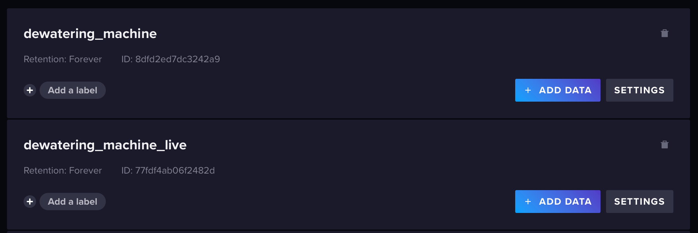
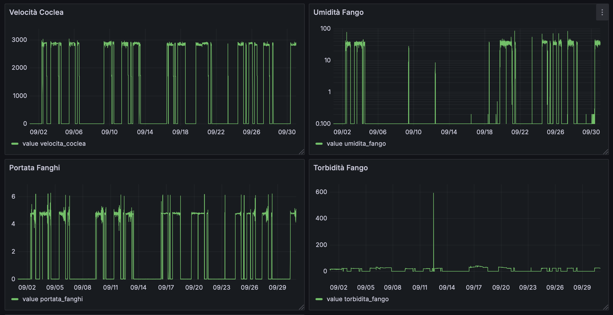
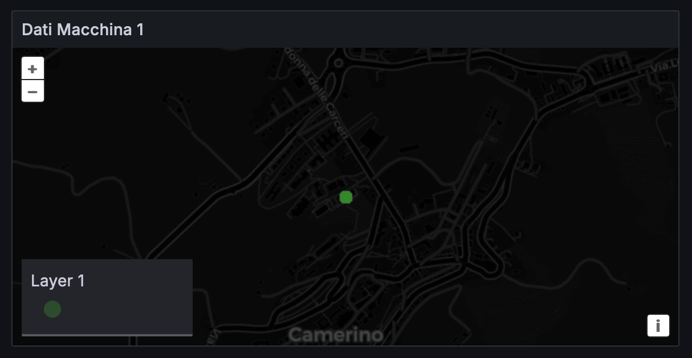

# TBDM CSP Dewatering Machine

The project revolves around analyzing and optimizing data from a dewatering machine used in the sludge dewatering process, which is considered as a Cyber-Physical System (CPS). By leveraging Big Data technologies, specifically InfluxDB and Grafana, the project aims to study, visualize, and derive insights from sensor data provided in the form of multiple datasets. These datasets include parameters such as polyelectrolyte concentration, differential speeds, mud flow rates, machine status, and more.

### Objectives

The objective is to study the tools, what features it offers, data map visualization, monitoring and alarm dashboards, AI tool integration. In particular, investigate influx V3 with comparison to the V2 version (performance, flux/sql hook language), integration API in real operational contexts (use of C#, Java, RESTAPI), limitations encountered.

## System Requirements
- Python 3.8 or higher
- Docker (for containerized deployment)
- Pip (Python package installer)

## Datasets
The datasets provided for the project are located in the [data-csv](data-csv) (CSV format versions) and [data-lp](data-lp) folders (Line Protocol format versions).

The datasets are the following:
- `portata_fanghi`: quantity of sludge entering the machine per unit of time. Measured in $M^3/h$ (Cubic Meter Per Hour).
- `portata_poly`: flow rate of polyelectrolyte entering the treatment process. Measured in $M^3/h$ (Cubic Meter Per Hour).
- `torbidita_chiarificato`:
- `torbidita_fango`: turbidity (the quantity of suspended particles) in the sludge entering the treatment system. Measured in g/l (grams per liter).
- `umidita_fango`: residual moisture percentage in the material after the dewatering process. This is a key indicator of the effectiveness of the separation process, particularly in applications like sludge treatment. Measured in percentage (%).
- `velocita_coclea`: rotation speed of the screw inside the machine, which is crucial for optimizing the separation efficiency of solids from liquids. Measured in rpm (revolutions per minute, giri al minuto).
- `velocita_tamburo`: rotation speed of the drum, responsible for separating solids from liquids through centrifugal force. Measured in rpm (revolutions per minute).

## Docker Compose

The Docker Compose configuration sets up an InfluxDB 2.7.11 and Grafana stack for time-series data storage and visualization:
- the **InfluxDB** service runs in a container named influxdb_v2, exposing port 8086 and initializing with an admin user and password. Its data is persisted using a named volume
	```docker
	influxdb:
		image: influxdb:2.7.11
		container_name: influxdb_v2
		ports:
			- "8086:8086"
		environment:
			- DOCKER_INFLUXDB_INIT_USERNAME=admin
			- DOCKER_INFLUXDB_INIT_PASSWORD=admin123
		volumes:
			- influxdb2_data:/var/lib/influxdb2
	```
- the **Grafana** service runs in a separate container, exposing port 3000, and is preconfigured with admin credentials. Grafana’s data is also stored in a persistent volume.
This setup provides an easy-to-deploy monitoring stack with InfluxDB for data collection and Grafana for dashboard visualization.
	```docker
	grafana:
    	image: grafana/grafana:latest
    	container_name: grafana
    	ports:
      		- "3000:3000"
    	environment:
      		- GF_SECURITY_ADMIN_USER=admin
      		- GF_SECURITY_ADMIN_PASSWORD=admin123
    	volumes:
      		- grafana_data:/var/lib/grafana
	```

You can build and run the [docker compose](docker-compose.yml) with:
```
docker-compose up
```

## InfluxDB

### Bucket Initialization
To create a new bucket in InfluxDB, follow these steps:
1. Open InfluxDB in your web browser by navigating to `http://localhost:8086`.
2. Log in with your credentials (username: `admin`, password: `admin123`).
3. Go to **Load Data** > **Buckets** > **Create Bucket**.
5. Enter the bucket name (for example `dewatering_machine_live`) and Set the retention period as needed



To create a new API token for accessing the bucket:
1. Go to **Load Data** > **API Tokens** > **Generate API Token** > **All Access Token**
2. Enter the token name and click Save

### Data Analytics Queries


## Grafana


### Connection to InfluxDB
To connect Grafana to InfluxDB, follow these steps:
1. Open Grafana in your web browser by navigating to `http://localhost:3000`.
2. Log in with the default credentials (username: `admin`, password: `admin123`).
3. Go to **Configuration** > **Data Sources**.
4. Click **Add data source** and select **InfluxDB**.
5. Configure the InfluxDB connection settings:
   - **Query Language**: `Flux`
   - **URL**: `http://influxdb:8086`
   - **Organization**: `Unicam`
   - **Token**: the one from InfluxDB
   - **Default Bucket**: `dewatering_machine`
6. Click **Save & Test** to verify the connection.

### Historical Dashboards
Historical dashboards allow you to visualize and analyze past data.




### Comparison Dashboards


### Geographical Dashboards
Geographical dashboards provide a spatial view of your data. 



### Alerts


## Scripts
Some Python scripts have been arranged for differen purposes:
- [convert_to_lp.py](scripts/convert_to_lp.py): converts CSV datasets to InfluxDB Line Protocol format.
- [convert_machine_data.py](scripts/convert_machine_data.py) converts CSV dataset [dati_macchina.csv](data-csv/dati_macchina.csv) to InfluxDB Line Protocol format.
- [iot_simulator.py](scripts/iot_simulator.py) simulates constant sensor data with slight variations and occasional anomalies, and writes it to InfluxDB.
- [simulator.py](scripts/simulator.py) simulates constant sensor data with drift and anomalies, and writes it to InfluxDB.

## Authors
The project was developed as part of the exam of Technologies for Big Data Management at the University of Camerino by the students Alessio Rubicini, Daniele Monaldi and Alessio Cinti, under the supervision of professor Massimo Callisto De Donato.