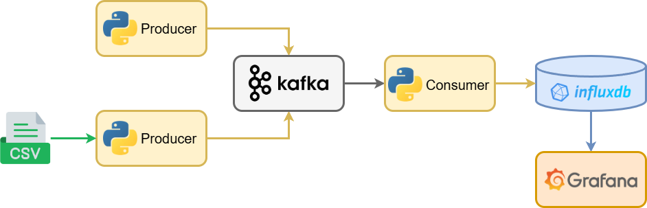
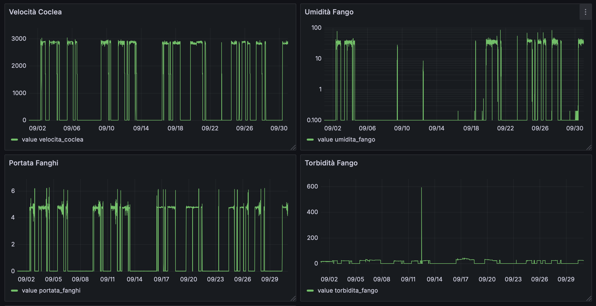
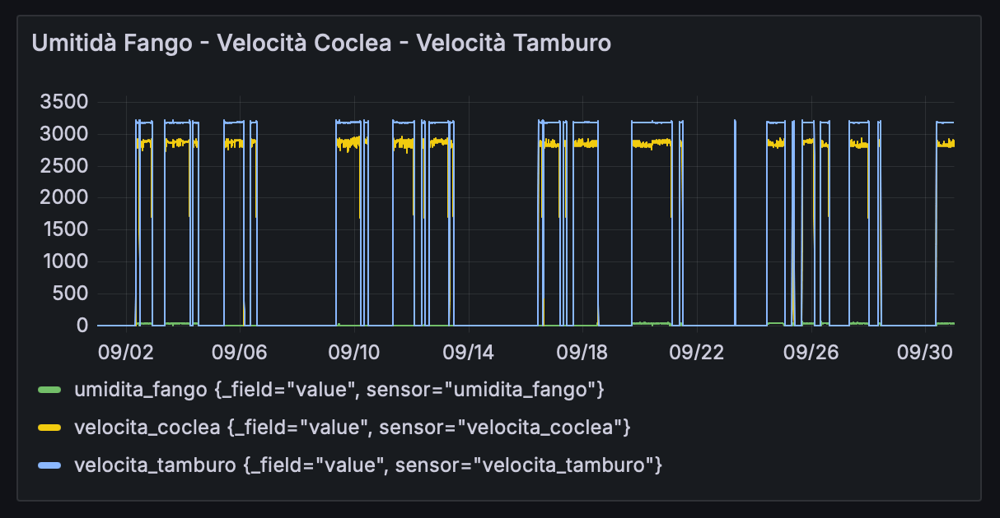
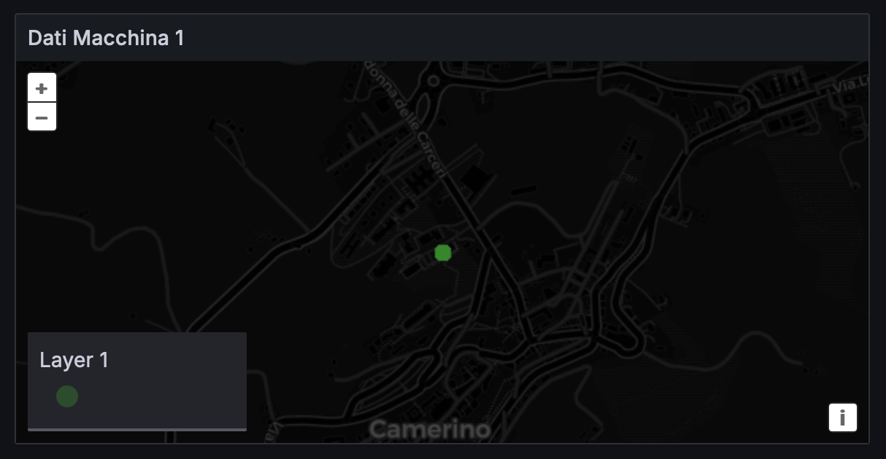
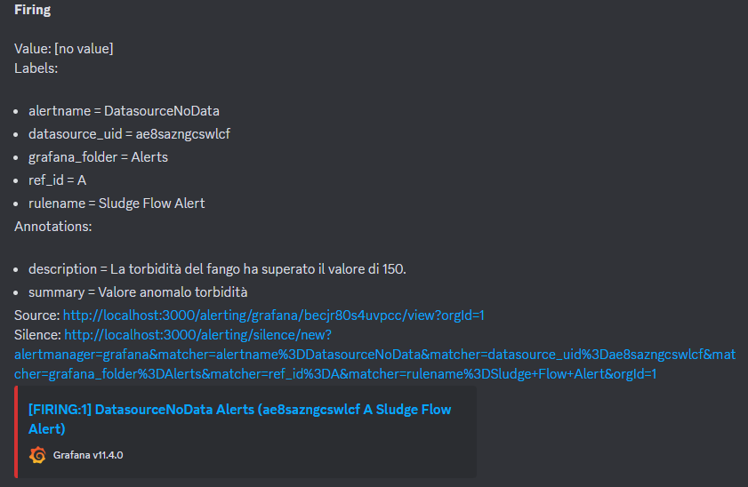

# TBDM CSP Dewatering Machine

The project revolves around analyzing and optimizing data from a dewatering machine used in the sludge dewatering process, which is considered as a Cyber-Physical System (CPS). By leveraging Big Data technologies, specifically InfluxDB and Grafana, the project aims to study, visualize, and derive insights from sensor data provided in the form of multiple datasets. These datasets include parameters such as polyelectrolyte concentration, differential speeds, mud flow rates, machine status, and more.

### Objectives

The objective is to study the tools, what features it offers, data map visualization, monitoring and alarm dashboards. In particular, investigate influx V3 with comparison to the V2 version (performance, flux/sql hook language), integration API in real operational contexts (use of C#, Java, RESTAPI, Python), limitations encountered.

### Project Structure


## System Requirements
- Python 3.8 or higher
- Docker (for containerized deployment)
- Pip (Python package installer)
- InfluxDB CLI

## Datasets
The datasets provided for the project are located in the [data-csv](data-csv) (CSV format versions) and [data-lp](data-lp) folders (Line Protocol format versions).

The datasets are the following:
- `portata_fanghi`: quantity of sludge entering the machine per unit of time. Measured in $M^3/h$ (Cubic Meter Per Hour).
- `portata_poly`: flow rate of polyelectrolyte entering the treatment process. Measured in $M^3/h$ (Cubic Meter Per Hour).
- `torbidita_chiarificato`:
- `torbidita_fango`: turbidity (the quantity of suspended particles) in the sludge entering the treatment system. Measured in g/l (grams per liter).
- `umidita_fango`: residual moisture percentage in the material after the dewatering process. This is a key indicator of the effectiveness of the separation process, particularly in applications like sludge treatment. Measured in percentage (%).
- `velocita_coclea`: rotation speed of the screw inside the machine, which is crucial for optimizing the separation efficiency of solids from liquids. Measured in rpm (revolutions per minute, giri al minuto).
- `velocita_tamburo`: rotation speed of the drum, responsible for separating solids from liquids through centrifugal force. Measured in rpm (revolutions per minute).

## Docker Compose

This project provides a **Docker Compose** environment for managing a data monitoring and streaming architecture using **InfluxDB**, **Grafana**, **Kafka**, and related components.

### 1. InfluxDB
InfluxDB is an open-source time-series database designed to store and query large amounts of time-stamped data.

- **Image:** `influxdb:2.7.11`
- **Exposed Port:** `8086`
- **Initial Credentials:**
  - **Username:** `admin`
  - **Password:** `admin123`
- **Mounted Volume:** `influxdb2_data` → `/var/lib/influxdb2`

For this project, we used InfluxDB V2. InfluxData is developing a new version, V3, which is currently in development. The difference between V2 and V3 is in [InfluxDB: V2 vs V3](docs/influxdb-v2-vs-v3.md).

### 2. Grafana
Grafana is a data visualization platform that allows users to create interactive dashboards.

- **Image:** `grafana/grafana:latest`
- **Exposed Port:** `3000`
- **Initial Credentials:**
  - **Username:** `admin`
  - **Password:** `admin123`
- **Mounted Volume:** `grafana_data` → `/var/lib/grafana`

### 3. Zookeeper
Zookeeper is a distributed coordination service used for managing Kafka.

- **Image:** `confluentinc/cp-zookeeper:latest`
- **Exposed Port:** `2181`
- **Configuration:**
  - `ZOOKEEPER_CLIENT_PORT=2181`
  - `ZOOKEEPER_TICK_TIME=2000`

### 4. Kafka
Apache Kafka is a distributed streaming platform for managing real-time data flows.

- **Image:** `confluentinc/cp-kafka:latest`
- **Exposed Ports:** `9092` (public), `29092` (internal to Docker)
- **Configuration:**
  - Broker ID: `1`
  - Connected to Zookeeper
  - Configured listeners for internal and external communications
- **Mounted Volume:** `kafka_data` → `/var/lib/kafka`

### 5. Kafka UI
Kafka UI is a graphical interface for monitoring and managing Kafka clusters.

- **Image:** `provectuslabs/kafka-ui:latest`
- **Exposed Port:** `7777`
- **Configuration:**
  - Cluster Name: `local-cluster`
  - Connected to Kafka (`kafka:29092`)
  - Connected to Zookeeper (`zookeeper:2181`)

## Used Volumes

- `influxdb2_data`: Stores InfluxDB data
- `grafana_data`: Stores Grafana data
- `kafka_data`: Stores Kafka data

## Running the Project

To start the entire stack, run:
```sh
docker-compose up -d
```

To stop and remove the containers:
```sh
docker-compose down
```

## Accessing Services

- **InfluxDB:** [http://localhost:8086](http://localhost:8086)
- **Grafana:** [http://localhost:3000](http://localhost:3000) (Credentials: `admin/admin123`)
- **Kafka UI:** [http://localhost:7777](http://localhost:7777)

## Kafka Streaming Data

### Kafka Topic Management

Create a Topic named dewatering-machine, running:
```sh
docker-compose exec kafka /bin/bash -c "kafka-topics --create --topic dewatering-machine --partitions 1 --replication-factor 1 --bootstrap-server localhost:9092"
```

### Testing with a Consumer
To debug and print real-time data from the topic:
```sh
docker-compose exec kafka kafka-console-consumer --bootstrap-server localhost:9092 --topic dewatering-machine --from-beginning --timeout-ms 5000
```

## InfluxDB

### Influx Configuration

To interact with InfluxDB, you need to configure the CLI with the organization, bucket, and authentication token.
1. Open InfluxDB in your web browser by navigating to `http://influxdb:8086`.
2. Set up an initial organization (Unicam) and bucket (dewatering-machine)
3. Copy the admin token that appears after setup. Alternately, go to **Load Data** > **API Tokens** > **Generate API Token** > **All Access Token** and create a new token.

Then configure CLI with credentials:
```sh
influx config create \
  --config-name my-config \
  --host http://influxdb:8086 \
  --org Unicam \
  --token YOUR_ADMIN_TOKEN \
  --active
```

Verify the configuration with:
```sh
influx config list
```

If you need to create a new bucket manually via CLI:
```sh
influx bucket create \
  --name dewatering-machine \
  --org Unicam \
  --retention 0  # 0 means infinite retention
```

Verify the bucket creation with:
```sh
influx bucket list
```

### Data Ingestion
Now, ingest the .lp datasets using CLI:
```sh
influx write --bucket dewatering-machine --file data/*.lp
```

### Data Analytics Queries

All data analytics queries, with their description and performance, are described in detail in [Data Analytics Queries](docs/data-analytics-queries.md). You can also find a detailed comparison of Flux and SQL query languages in [Flux vs SQL](docs/flux-vs-sql.md).


## Grafana


### Connection to InfluxDB
To connect Grafana to InfluxDB, follow these steps:
1. Open Grafana in your web browser by navigating to `http://grafana:3000`.
2. Log in with the default credentials (username: `admin`, password: `admin123`).
3. Go to **Configuration** > **Data Sources**.
4. Click **Add data source** and select **InfluxDB**.
5. Configure the InfluxDB connection settings:
   - **Query Language**: `Flux`
   - **URL**: `http://influxdb:8086`
   - **Organization**: `Unicam`
   - **Token**: `YOUR_ADMIN_TOKEN`
   - **Default Bucket**: `dewatering_machine`
6. Click **Save & Test** to verify the connection.

### Dashboards
Grafana dashboards are interactive visualizations that allow you to monitor and analyze your data in real-time. They consist of various panels, each displaying a specific metric or set of metrics from your data sources.

> ⚠ All dashboards are located in the [dashboards](dashboards/) folder as JSON files that can be imported into Grafana.

#### Historical Dashboards
Historical dashboards allow you to visualize and analyze past data.




#### Comparison Dashboards


#### Geographical Dashboards
Geographical dashboards provide a spatial view of your data. 



### Alerts
Grafana alerts allow you to monitor your data and receive notifications when certain conditions are met. You can set up alert rules based on your queries, and Grafana will continuously evaluate these rules. When the conditions of an alert rule are satisfied, Grafana can send notifications through various channels such as email, Slack, or custom webhooks.

For convenience, we used Discord as our contact point.



## Scripts
Some Python scripts have been arranged for different purposes:
- [convert_to_lp.py](scripts/convert_to_lp.py): converts CSV datasets to InfluxDB Line Protocol format.
- [convert_machine_data.py](scripts/convert_machine_data.py): converts CSV dataset [dati_macchina.csv](data-csv/dati_macchina.csv) to InfluxDB Line Protocol format.
- [kafka_producer](scripts/kafka_producer): simulates constant sensor data with slight variations and occasional anomalies, and writes it to Kafka topic.
- [kafka_consumer](scripts/kafka_consumer): reads the data from Kafka topic and ingest them into InfluxDB bucket.

To use the Python scripts in this project, you must navigate to the project directory and activate the virtual environment:
```sh
source venv/bin/activate
```

Then install the required PiP requirements:
```sh
pip install -r scripts/requirements.txt
```

## Authors
The project was developed as part of the exam of Technologies for Big Data Management at the University of Camerino by the students Alessio Rubicini, Daniele Monaldi and Alessio Cinti, under the supervision of professor Massimo Callisto De Donato.
